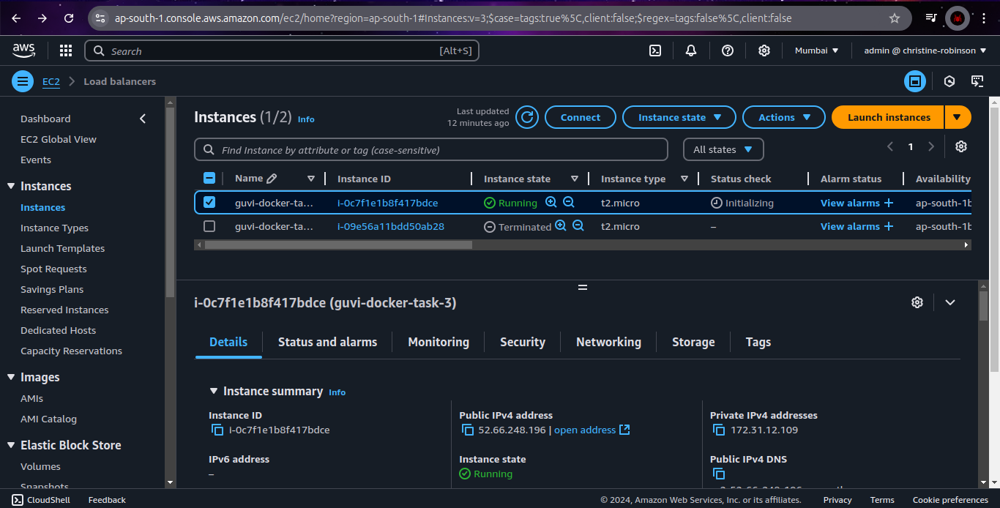
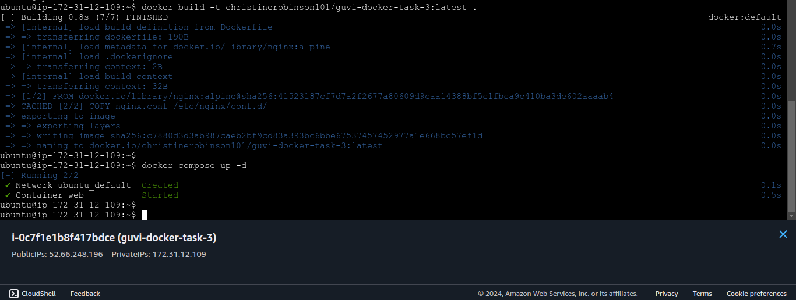
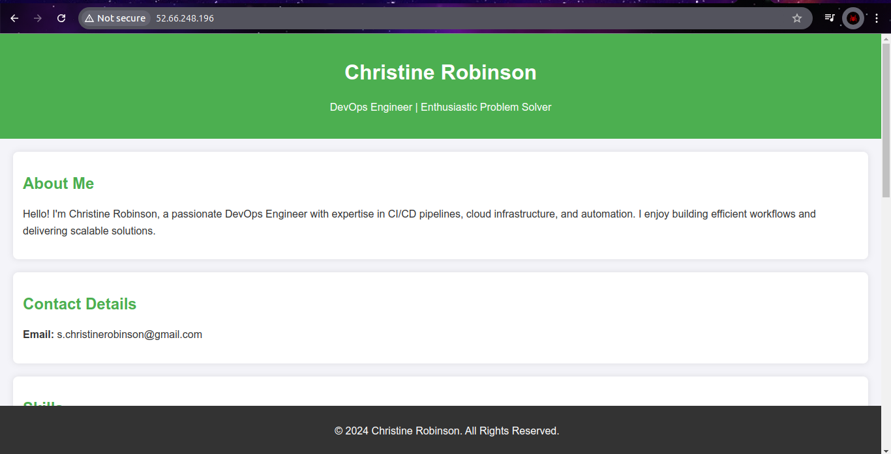
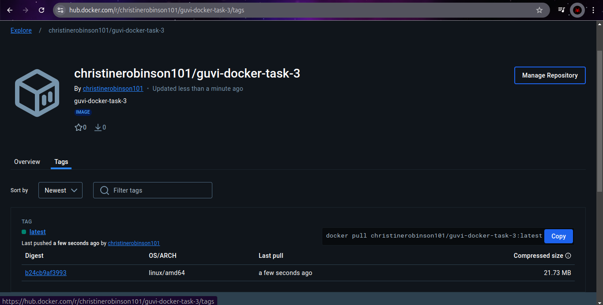

# 8. Docker Task 3 #

## Instructions ##

### 1. Launch an EC2 instance and open port 80 in its security group ###




### 2. Install Docker Engine on the EC2 Instance ###

> ***Ref:*** [https://docs.docker.com/engine/install/ubuntu/#install-using-the-repository](https://docs.docker.com/engine/install/ubuntu/#install-using-the-repository)

```bash
# Add Docker's official GPG key:
sudo apt-get update
sudo apt-get install -y ca-certificates curl
sudo install -m 0755 -d /etc/apt/keyrings
sudo curl -fsSL https://download.docker.com/linux/ubuntu/gpg -o /etc/apt/keyrings/docker.asc
sudo chmod a+r /etc/apt/keyrings/docker.asc

# Add the repository to Apt sources:
echo \
  deb [arch=$(dpkg --print-architecture) signed-by=/etc/apt/keyrings/docker.asc] https://download.docker.com/linux/ubuntu \
  $(. /etc/os-release && echo $VERSION_CODENAME) stable | \
  sudo tee /etc/apt/sources.list.d/docker.list > /dev/null

sudo apt-get update

# Install the Docker packages
sudo apt-get install -y docker-ce docker-ce-cli containerd.io docker-buildx-plugin docker-compose-plugin

# Add the current user to the docker group, so you can run Docker commands without sudo.
sudo usermod -aG docker $USER

# Reboot the instance
sudo reboot
```

### 3. Verify the Installation ###

```bash
# Verify the installation 
docker run hello-world
```


### 4. Create required files ###

> web/index.html

```html
<!DOCTYPE html>
<html lang="en">

<head>
  <meta charset="UTF-8">
  <meta name="viewport" content="width=device-width, initial-scale=1.0">
  <title>About Christine Robinson</title>
  <link rel="stylesheet" href="style.css">
</head>

<body>
  <header>
    <h1>Christine Robinson</h1>
    <p>DevOps Engineer | Enthusiastic Problem Solver</p>
  </header>

  <main>
    <section>
      <h2>About Me</h2>
      <p>Hello! I'm Christine Robinson, a passionate DevOps Engineer with expertise in CI/CD pipelines, cloud
        infrastructure, and automation. I enjoy building efficient workflows and delivering scalable solutions.</p>
    </section>

    <section>
      <h2>Contact Details</h2>
      <p><strong>Email:</strong> s.christinerobinson@gmail.com</p>
    </section>

    <section>
      <h2>Skills</h2>
      <ul>
        <li>Cloud Platforms: AWS, Azure</li>
        <li>CI/CD Tools: Jenkins, GitHub Actions</li>
        <li>Containerization: Docker, Kubernetes</li>
        <li>Monitoring: Prometheus, Grafana</li>
        <li>Programming: Python, Bash</li>
      </ul>
    </section>
  </main>

  <footer>
    <p>&copy; 2024 Christine Robinson. All Rights Reserved.</p>
  </footer>
</body>

</html><!DOCTYPE html>
<html lang="en">

<head>
  <meta charset="UTF-8">
  <meta name="viewport" content="width=device-width, initial-scale=1.0">
  <title>About Christine Robinson</title>
  <link rel="stylesheet" href="style.css">
</head>

<body>
  <header>
    <h1>Christine Robinson</h1>
    <p>DevOps Engineer | Enthusiastic Problem Solver</p>
  </header>

  <main>
    <section>
      <h2>About Me</h2>
      <p>Hello! I'm Christine Robinson, a passionate DevOps Engineer with expertise in CI/CD pipelines, cloud
        infrastructure, and automation. I enjoy building efficient workflows and delivering scalable solutions.</p>
    </section>

    <section>
      <h2>Contact Details</h2>
      <p><strong>Email:</strong> s.christinerobinson@gmail.com</p>
    </section>

    <section>
      <h2>Skills</h2>
      <ul>
        <li>Cloud Platforms: AWS, Azure</li>
        <li>CI/CD Tools: Jenkins, GitHub Actions</li>
        <li>Containerization: Docker, Kubernetes</li>
        <li>Monitoring: Prometheus, Grafana</li>
        <li>Programming: Python, Bash</li>
      </ul>
    </section>
  </main>

  <footer>
    <p>&copy; 2024 Christine Robinson. All Rights Reserved.</p>
  </footer>
</body>

</html>
```

> web/style.css

```css
body {
  font-family: Arial, sans-serif;
  margin: 0;
  padding: 0;
  background-color: #f4f4f9;
  color: #333;
}

header {
  background-color: #4CAF50;
  color: white;
  padding: 20px;
  text-align: center;
}

main {
  padding: 20px 20px 100px;
}

section {
  margin-bottom: 20px;
  padding: 15px;
  background-color: white;
  box-shadow: 0 0 10px rgba(0, 0, 0, 0.1);
  border-radius: 8px;
}

h1 {
  color: white;
}

h2 {
  color: #4CAF50;
}

p {
  line-height: 1.6;
}

footer {
  text-align: center;
  padding: 10px;
  background-color: #333;
  color: white;
  position: fixed;
  bottom: 0;
  width: 100%;
}
```

> nginx.conf

```nginx
server {
    listen 80;
    server_name localhost;

    location / {
        root /var/opt/nginx/;
        index index.html;
    }
}
```

> Dockerfile

```Dockerfile
# Use the official Nginx image
FROM nginx:alpine

# Copy the custom Nginx configuration
COPY nginx.conf /etc/nginx/conf.d/default.conf

# Expose port 80
EXPOSE 80
```

> docker-compose.yml

```docker-compose
services:
  web:
    image: christinerobinson101/guvi-docker-task-3:latest
    container_name: web
    ports:
      - 80:80
    volumes:
      - ./web:/var/opt/nginx:ro
```


### 5. Build Docker Image, Run the docker container & visit the website by IP address of EC2 instance ###

```bash
docker build -t christinerobinson101/guvi-docker-task-3:latest .

docker compose up -d
```





### 6. Push Docker Image to DockerHub ###

```bash
# Login to DockerHub
docker login -u christinerobinson101
# Put the personal access token for authorization

# Push the docker Image to DockerHub
docker push christinerobinson101/guvi-docker-task-3:latest
```



